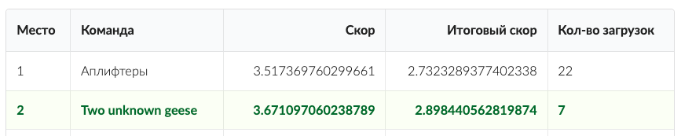

# Lenta \& Microsoft Hackathon

## Motivation

Given a list of promotions and receipt data for a random sample of [Lenta](https://hack.promo/) customers for the past four quarters predict the success of promotions for each product for the next quarter of the year.

## Metric

Mean Absolute Error between the real UpLift and the predicted UpLift.

UpLift = (Total sales in the promo period / Total sales in the pre-period) - 1

## Model

* Aggregate receipts data by SKU
* Empirically evaluate the UpLift metric on historical data for each SKU
* Calculate the UpLift for product categories
* Estimate the demand on each SKU through the approximation of demand Q=b-kP, which healped to build model accounting for the elasticity of demand for goods
* Calculate statistical characteristics of SKUs: average price, average amount in the receipt e. t. c.

Trained boosting regressor on generated features.

## Result

Top-2 score on private test (Two unknown geese team):

Third place in the final pitch.

[Media](https://cs.hse.ru/hack-club/news/480831772.html) about my team :)